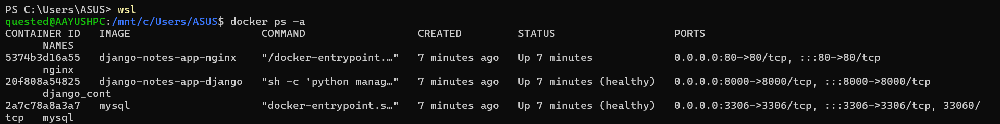

# 🐳 Dockerized Notes App – Django + MySQL + Nginx

This project is a containerized version of a prebuilt Django application using **Docker** and **Docker Compose**. It uses a multi-service architecture including:

- 🐍 Django (Python backend)
- 🐬 MySQL (Database)
- 🌐 Nginx (Reverse Proxy)
- 🛠️ Docker & Docker Compose for container orchestration

> ⚠️ **Warning**: This project contains hard-earned DevOps lessons. Expect broken containers, emotional debugging, and ultimate victory. 😤

---

## 🚀 Quick Start

### 1. Clone the repository

```
git clone https://github.com/your-username/personal-notes-app.git
cd docker-notes-app
```
2. Set up your .env file
Create a .env file in the root directory:
```
DJANGO_SECRET_KEY=your-secret-key
DEBUG=True
ALLOWED_HOSTS=localhost 127.0.0.1
DB_NAME=test_db
DB_USER=root
DB_PASSWORD=root
DB_HOST=db
DB_PORT=3306
```
3. Build and start the containers
```
docker-compose up --build
```
4. Access the app
Service	URL
Django	http://localhost:8000
Admin	http://localhost:8000/admin
Nginx	http://localhost
MySQL	localhost:3306 (external)

Username: root | Password: root (default, do not use in production!)

📁 Project Structure

<br>.
<br>├── backend/              # Django app code
<br>│   ├── manage.py
<br>│   └── ...
<br>├── nginx/                # Nginx Docker config
<br>│   └── default.conf
<br>├── Dockerfile            # Builds Django image
<br>├── docker-compose.yml    # Multi-container setup
<br>├── .env                  # Environment variables
<br>└── README.md             # You're here!
❤️ Healthchecks FTW
Debugging startup order was painful. MySQL wasn't ready when Django started. Nginx screamed. So I used healthchecks to delay container readiness.

```
healthcheck:
  test: ["CMD", "mysqladmin", "ping", "-h", "localhost", "-uroot", "-proot"]
  interval: 10s
  timeout: 5s
  retries: 5
  start_period: 60s
```
Same for Django:
```
healthcheck:
  test: ["CMD-SHELL", "curl -f http://localhost:8000/admin || exit 1"]
  interval: 10s
  timeout: 5s
  retries: 5
  start_period: 60s
```
🧠 What I Learned
Docker networking: services communicate via their container name (db, django, nginx).

depends_on only controls startup order, not readiness – use healthchecks!

YAML syntax quirks (array vs key-value formats)

Debugging containers: logs, restart loops, and tears.

🖼️ Screenshots

1.Docker Compose up (Terminal)


2.Docker Dashboard / docker ps -a Output



3.Django Web App Home Page


4.Container Logs / Healthchecks Pass


6.Docker Desktop 


🛑 Not Deploying Yet
I'm avoiding cloud deployment for now due to budget constraints, but this project is deployment-ready and can be hosted on:

Fly.io

Render

Railway

Heroku (with tweaks)

Or Any Vm (AWS, GCP, AZURE)

📚 Resources I Used
TrainWithShubham YouTube Series

Docker Compose Docs

Docker Healthcheck Guide

📜 License
MIT License – use it, break it, fix it, improve it.

✍️ Author

👤 Name	🔗 Profile
Aayush Kukade	
<br>[LinkedIn](https://www.linkedin.com/in/aayushkukade/) • [Medium](https://medium.com/@sroy10012001)
